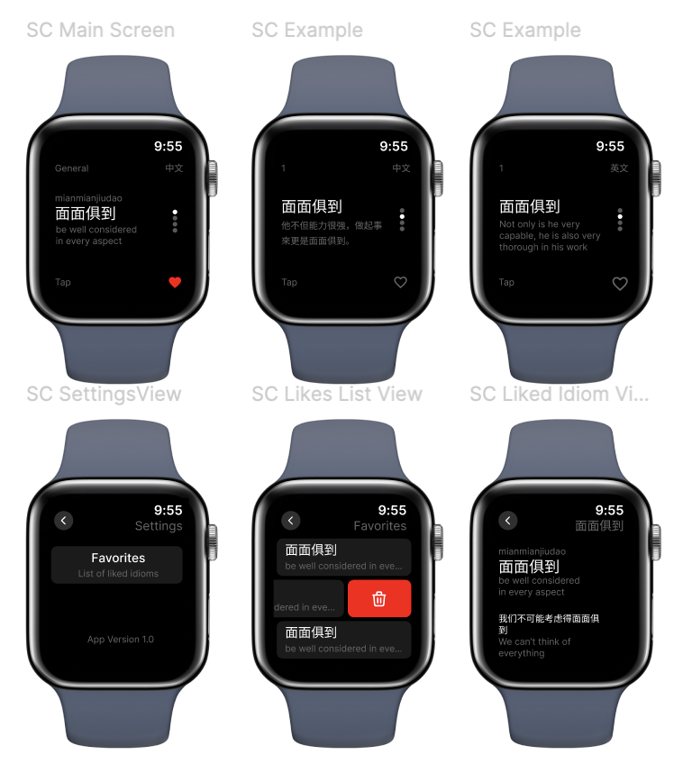

# Chengyu

Building my first SwiftUI project to learn iOS development. The goal is too display a Chinese idiom each day along with its definition, pinyin, and some example sentences.

## Environment
- XCode Version 15.3 (15E204a)
- WatchOS Deployment Target 10.0

## WatchOS
I wanted to start out simple, so I started out with a simple WatchOS App

## iPhone OS

Why not build a compatable ios app? 

Concept: 

## Concepts Covered
- UserDefaults (and ObservableObject)
- Codable (Bundle and JSON)
- NavigationStack
- WatchOS
  - Crown Scrolling
